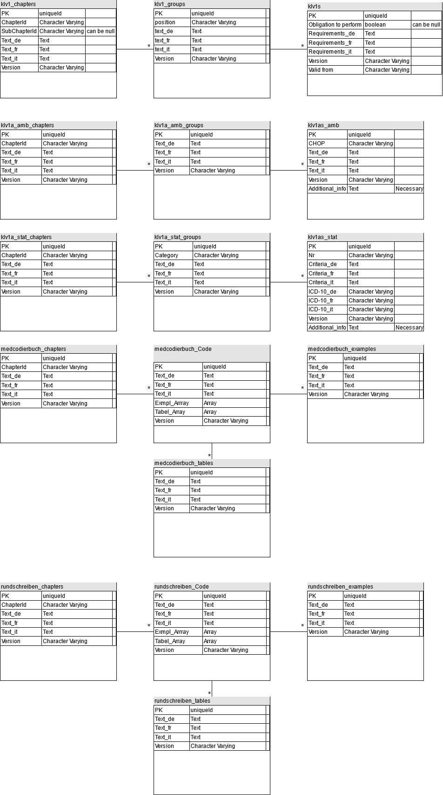

# Lösungsdokumentation eonum

## Beschrieb

Diese Dokumentation beschreibt die erarbeiteten Lösungen für die Erweiterungen von MCS (MedCodeSearch). MCS ist ein Such-
portal für die medizinische Kodierung, sowohl als Website zugänglich als auch als öffentliche API. Enthalten in diesem
Dokument sind neben Text auch Diagramme, Bilder etc.
Die Erweiterung von MCS beinhaltet folgende Punkte:

- Ergänzung der bestehenden Inhalte mit Gesetzestexten und Handbüchern
- Integration der neuen Inhalte ins FE und BE.

## Ziel 1

Als erstes Ziel sollen folgende Punkte erfüllt werden:

- Wenn ich mich im Reiter Gesetze befinde, dann kann ich nach Protonen-Strahlentherapie suchen. Alle Suchergebnisse im
 Reiter Gesetze sollen nun angezeigt werden.
- Überall wo das Wort ’Protonen-Strahlentherapie’ vorkommt, soll es markiert werden.
- Ich kann nun auf ein Resultat klicken und mehr darüber lesen.

### Beschreibung System und Lösungsansätze

#### Datenabholung

Die zu integrierenden Datensätze sind die Anhänge 1 und 1a des KLV sowie das Kodierhandbuch und das dazugehörige
Rundschreiben. Erstere finden sich [hier](https://www.bag.admin.ch/bag/de/home/versicherungen/krankenversicherung/krankenversicherung-leistungen-tarife/Aerztliche-Leistungen-in-der-Krankenversicherung/anhang1klv.html)
 und das Kodierhandbuch mit dem Rundschreiben [hier](https://www.bfs.admin.ch/bfs/de/home/statistiken/gesundheit/nomenklaturen/medkk/instrumente-medizinische-kodierung.html).

Es soll nun in einem ersten Schritt der KLV Anhang 1 mit dem Webcrawler abgegriffen werden. Das soll mit Rake Tasks geschehen, wie
folgendes Beispiel zeigt:

Die Packages "open-uri" und "Nokogiri" erlauben das Öffnen bzw. Parsen von Websiten. Damit kann eine Website abgerufen
und als HTML Dokument im Code verfügbar gemacht werden. Des Weiteren bietet "Nokogiri" auch entsprechende Methoden, um
das HTML Dokument zu durchsuchen, beispielsweise mit CSS Selektoren. So können auf der BAG und BFS Seite die richtigen
Links zu den richtigen Quellen gefunden werden und so die PDFs geholt werden.
Damit ein PDF gelesen werden kann, braucht es zusätzlich das gem "pdf-reader".

Folgender Task besucht die BFS Website und holt das Kodierungshandbuch 2021:

```
task :get_handbuch do
    base_url = 'https://www.bfs.admin.ch'
    links = []
    html_doc = Nokogiri::HTML(open(base_url + '/bfs/de/home/statistiken/gesundheit/nomenklaturen/medkk/instrumente-medizinische-kodierung.html'))
    html_doc.css('div[data-url*="kodierungshandbuch"]').each do |div|
      links << div['data-url']
    end
    link = links.first
    detail_page_link = Nokogiri::HTML(open(base_url + link)).css('a[class]').first['href']
    handbook_link = Nokogiri::HTML(open(base_url + detail_page_link)).css('a[class*="download-event"]').first['href']
    reader = PDF::Reader.new(open(base_url + handbook_link))
    puts reader.page_count
  end
```

Im Task sollte dann das geholte PDF abgelegt werden und dann der Task für das Parsen der Dokumente angestossen werden, sobald
alle Dokumente abgeholt sind, bzw. evtl. zuerst der Task für die Konvertierung der PDFs in ein maschinenlesbares Format.

Die Konverter / Parser - Thematik ist im Moment noch ein grosser weisser Fleck, im Folgenden werden Optionen für den Parser
diskutiert.

##### Parser

Folgende Gems / Libs sind für den Parser bis jetzt betrachtet worden:

- pdf-reader: ist ein Ruby-Gem, welches ermöglicht, PDF Files zu öffnen und auch gewisse Extraktionen zu machen (v.a. Text
  kann aus dem PDF herausextrahiert werden, dies ist jedoch nicht sehr akkurat...). Zudem kann das Dokument auf sehr tiefer
  Ebene durchgegangen werden, d.h. man kann low-level objects abgreifen. Um damit aber etwas anzufangen, bräuchte es rel. viel
  PDF Knowledge, deshalb nicht unbedingt geeignet.
  
- yomu: Ist ein weiteres Ruby-Gem, welches PDFs öffnen und auch umwandeln, bzw. Metadaten abgreifen kann. Die Transformation in
  ein HTML-File funktioniert auch relativ gut, aber für Tabellenstrukturen wird der ganze Inhalt durcheinander gewürfelt, d.h.
  auch nicht alleinig geeignet.
  
- Docsplit ist ein weiteres Ruby-Gem, mit dem PDFs gesplittet werden können oder auch Text extrahiert werden kann, aber auch
  da ist die Text-Extraktion nicht geeignet, da so überhaupt keine Struktur der PDFs übernommen wird. Einzig was von Nutzen sein
  könnte, ist die Fähigkeit, das PDFs in einzelne Seiten zu splitten.
  
- Neben den Ruby-Gems, gibt es auch noch die Möglichkeit, mit System-Calls die Befehle `pdftotext` bzw. `pdftohtml` auszuführen.
  Diese wandeln die PDFs in Text bzw. HTML files um, mit sogar relativ guter Accuracy, jedoch gehen auch da im HTML beispielsweise
  die Tabellenstrukturen verloren, also auch da nicht alleinig geeignet für das Konvertieren / Parsen der PDFs.
  
- Iguvium: ist ein Ruby-Gem mit dem sich Tabellen aus einem PDF auslesen lassen und verschiedenst konvertieren (in Arrays 
  direkt in Ruby, in CSV, etc.). Damit könnte also das Problem der Tabellen in den Files gelöst werden. Diese Gem braucht
  aber Ghostscript als Abhängigkeit installiert auf dem OS, auf dem es läuft.
  
- Nebst Ruby-Gems besteht auch die Möglichkeit, den Parser / Konverter in Python zu schreiben. Hier gibt es dedizierte Libs, 
  welche PDFs verarbeiten können (PDFMiner, PyPDF2, pdfrw, slate, camelot)
  
Lösungsansätze:

Für den KLV Anhang 1 ist gegeben, dass alles in Tabellenform ist, ausser der Überschriften der Abschnitte. Ansonsten ist die
Tabelle aber immer gleich aufgebaut, nämlich mit "Massnahmen", "Leistungspflicht", "Voraussetzungen" und "gültig ab". Da es nicht
möglich ist, gleichzeitig normalen Text und Tabellen zu extrahieren, bietet sich hier folgende Idee an:
  
Da alle Überschriften und Abschnitte im Inhaltsverzeichnis aufgelistet sind, auch mit den jeweiligen Seitenzahlen, kann man
zweistufig vorgehen: Extrahiere zuerst aus dem Inhaltsverzeichnis Informationen über das Dokument. Insbesondere die Überschriften,
bzw. Kapitel, auf welcher Seite diese zu finden sind, auf wie viele Seiten sich das erstreckt. Dann sammle diese Informationen und
gehe gemäss diesen auf die jeweiligen Seiten, extrahiere die Tabellen und extrahiere dann aus den Tabellen jeweils die notwendigen
Informationen, die dann in die Datenbank geschrieben werden. So kann man sicher sein, dass man zu jeder Tabelle, die man extrahiert
auch den Abschnitt weiss, bzw. dass aller Inhalt gemäss dem Inhaltsverzeichnis aufgenommen wird.

Dazu muss man also zuerst das Inhaltsverzeichnis lokalisieren, aus diesem alle Informationen extrahieren und dann die entsprechenden
Seiten besuchen, um die Tabellen zu extrahieren.

#### Datenbank

Folgendes Diagramm zeigt das Schema Version 1.0:



#### API

tbd

#### Frontend

[Link](https://github.com/TheCodear/PSE-eonum-docrepo/blob/master/Dokumentation/FE_Mockup.pdf) zu den Design Mockups im Frontend.
