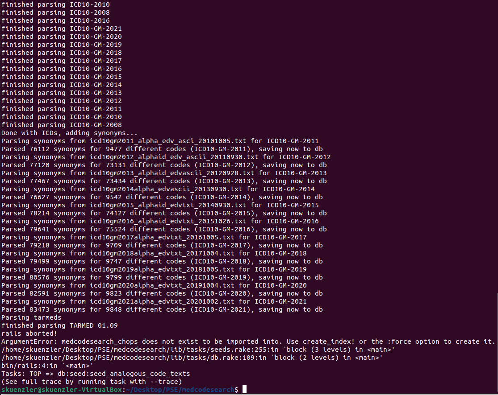

# Projekt Cheat Sheet

Nützliches Know-How, Links, Pitfalls beim Projekt, etc. alles hier drin gesammelt.

## Links

### Ruby Cheat Sheets

http://www.testingeducation.org/conference/wtst3_pettichord9.pdf

[Ruby Quickref for Syntax etc.](https://www.zenspider.com/ruby/quickref.html)

[Cheat sheet for terminal](http://cheat.errtheblog.com/)


#### Ruby Controller

- Logical center of application, coordinates interaction between user, views and model. 
	- routs external requests to internal actions
	- manages helpers which extend the capabilities of the view templates
	- manages sessions 
```
rails generate controller Book
```


#### Helpers

search_helper.rb

highlights keywords

#### Views

json is handled by frontend


#### Models

Each entity (such as book) gets a table in the database named after it, but in the plural (books).

Notice that you are capitalizing Book and Subject and using the singular form. This is a Rails paradigm that you should follow each time you create a model.

```
ruby script/generate model Book
```

create connection between models:

has_one, has_many, belongs_to, and has_and_belongs_to_many.

[More Model](https://www.tutorialspoint.com/ruby-on-rails/rails-models.htm)


#### Migrations

```
rails generate migration table_name
 
export RAILS_ENV = development
//
export RAILS_ENV = test 

rake db:migrate
```

## Setup

### rails db:reseed['data']

Wenn bei diesem Befehl (dauert sehr lange!) folgender Fehler auftritt:

(bzw. statt medcodesearch_chops medcodesearch_icds)

Dann kann das folgendermassen gelöst werden:

`rails console`, dann kommt man in eine andere Konsolenumgebung und dann muss man `Chop.import(force: true)` bzw. 
`Icd.import(force: true)` ausführen. Danach kann man den reseed erneut machen und sollte nun durchlaufen.

### [!!!] Index does not exist (Elasticsearch::Transport::Transport::Errors::NotFound)

Normalerweise wird bei diesem Fehler zusätzlich noch angegeben, bei welchem Model der Fehler auftritt (Chop, Adrg, Drg,
Tarmed, Icd). Mit dieser zusätzlichen Information kann folgendes getan werden:

Gehe mit `rails console` in die Rails Konsolenumgebung, dort gebe folgende Befehl(e) ein (angenommen der Fehler bezieht
sich auf Drg):

```
Drg.__elasticsearch__.create_index!
Drg.__elasticsearch__.create_index!(force: true)
Drg.import(force: true)
```

Manchmal reicht es, nur den ersten Befehl auszuführen, manchmal braucht es auch noch die force Option, bzw. den import
Befehl mit der force Option.
